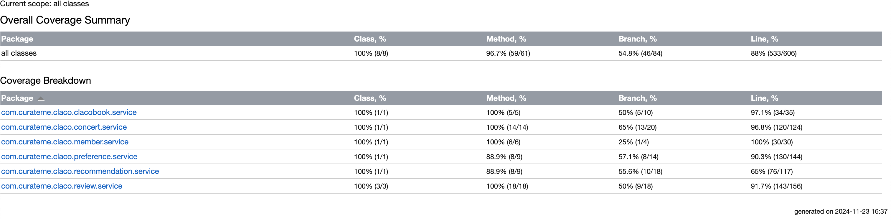
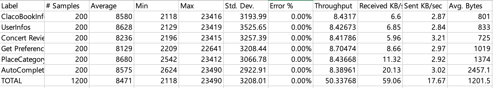
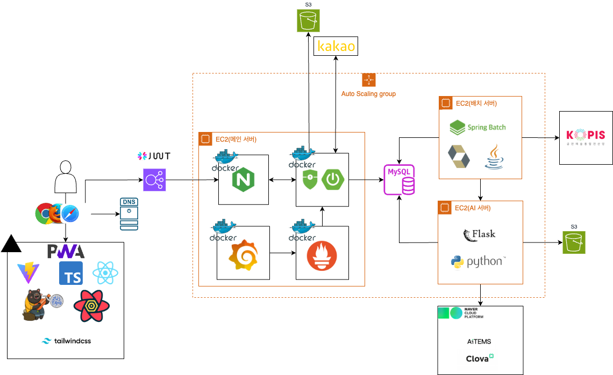
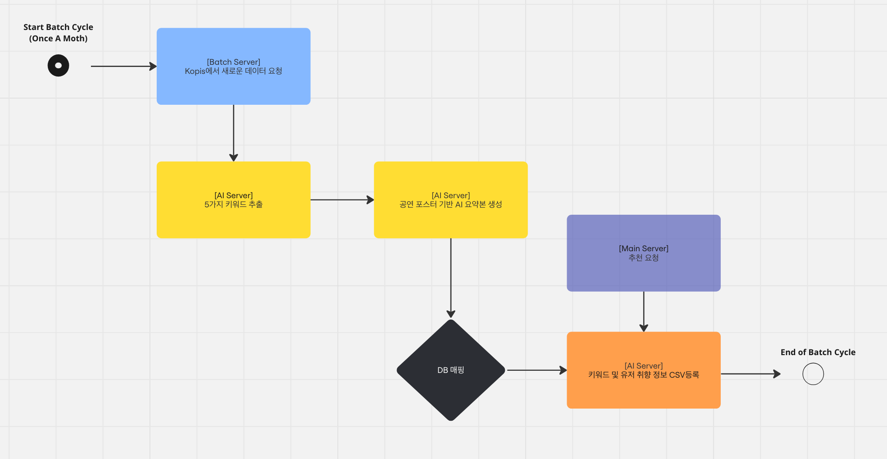
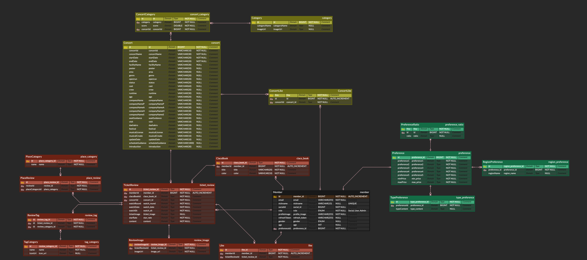
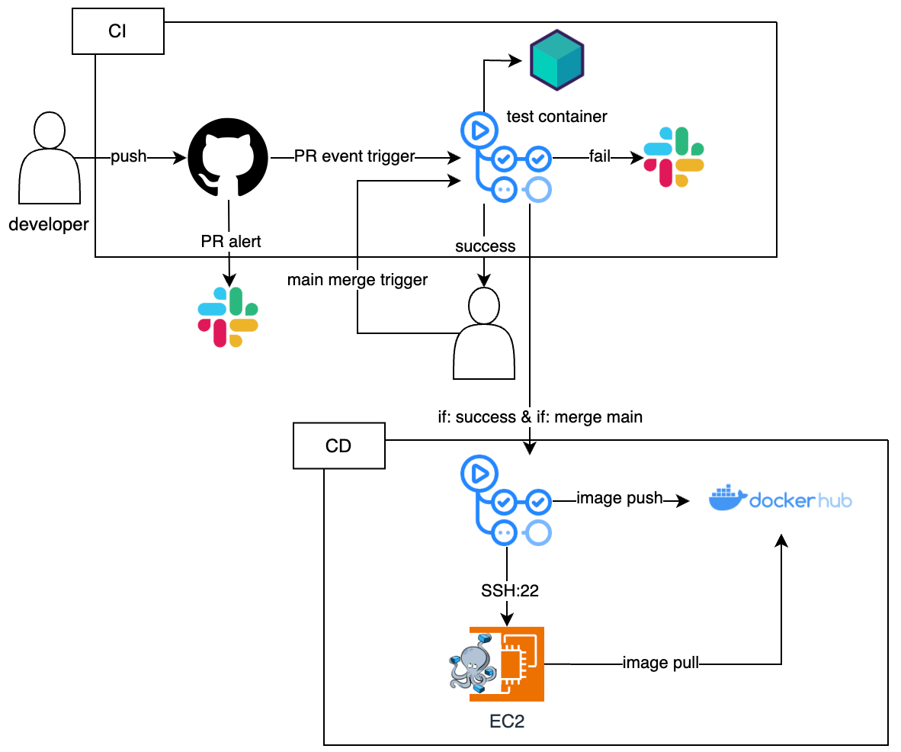

# Claco 메인 서버 레포지토리

## 🧑‍💻 R&R
| Profile | Name | Role |
| :---: | :---: | :---: |
| <a href="https://github.com/devkeon"></a> | 이건(개발리드) <br> **devkeon**| 아키텍처 설계, ERD 설계, 메인 서버 인프라 및 CI/CD 구축, <br> 인증/인가, 모니터링 시스템 구축, 티켓/리뷰 기능,<br> 클라코북 기능, 회원 관련 기능|
| <a href="https://github.com/anselmo228"></a> | 정희찬 <br> **anselmo**| ERD 설계, AI 및 배치 서버 인프라 및 CI/CD 구축, <br> 추천 AI 모델 구현, 배치 기능(데이터 로드) 구축, <br> 공연 기능, 공연 및 티켓 추천 기능|

## 개발 내용

### 📆 개발 기간
- ***2024.10.05 ~ 2024.11.24***

### 💻 개발 환경
> Language: ```Java 17``` <br>
> Framework: ```Spring Boot 3.3.4``` <br>
> Database: ```MySQL 8.x``` <br>
> ORM: ```JPA(Hibernate)``` <br>
> CI/CD: ```Github Actions``` <br>
> Cloud Platform: ```AWS(EC2, ALB, ACM), GCP(SQL)``` <br>
> Test DB: ```testcontainer```

### ⚙️ 개발 프로세스
- ```TDD (테스트 주도 개발)``` : 구문 커버지리 (Statement coverage) 기준 80%를 목표로 수행 
- ```Agile (애자일 프로세스)``` : 1주 단위 스프린트 수행
- ```Github Flow 전략``` : 초기 개발 과정에서 불필요한 브랜치 관리를 피하고, 빠른 배포를 위한 전략 선택
- ```CI/CD 파이프라인을 통한 배포 자동화``` : 서비스 개발이 50% 완료된 시점에서 구축하여 배포 자동화

### 💫 TDD 결과
- Service는 단위 테스트, Repository는 통합 테스트 진행
- ```testcontainer```를 활용하여 데이터베이스 멱등성 보장
- 테스트 코드 커버리지 측정 툴: ```IntelliJ``` <br>


- summary
  - statement coverage 기준: 88%
  - branch coverage: 54.8%
  - class coverage: 100%
  - method coverage: 96.7%

### 💫 부하 테스트 결과
- 사용 인스턴스 유형: ```t2.large (ram 8GB)```
- 부하 테스트 측정 툴: ```Jmeter```


- summary
  - 도메인별 주요 api 평균 50.3 Throughput

## 🏛️ 아키텍처


### 보안 고려 사항
- JWT를 활용한 인증/인가
  - SSL 보안 계층을 활용한 토큰 암호화 (HTTPS, ALB 설치)
  - CSRF / XSS 공격에 대비한 토큰 저장 분리 (Local storage, HTTP-only Cookie)
- Nginx를 활용한 actuator와 같은 민감 정보 deny
- Spring Security를 활용한 철저한 Auth 검사 및 uri 접근 조정
- Kakao OAuth2.0을 활용한 인증/인가 기능 간편화
- docker 네트워크를 활용하여 spring 서버나, prometheus같은 인스턴스 포트 매핑x (Endpoint 단일화)

### 추천 시스템 로직

- Collaborative Filtering & Cosine Similarity 기반 추천시스템
  1. 각 Concert는 AI가 추출해준 키워드 값에 대해 0 ~ 1 사이의 값을 가짐
  2. 유저도 마찬가지로 온보딩에서 등록한 취향 정보로 부터 모든 키워드 값에 대해 0 ~ 1사이 값을 가짐
  3. Concerts, Users CSV파일을 통해서 Cosine Similarity와 Collaborative Filtering을 통한 유사도 계산 후 추천 진행

### 메인 서버
- 서비스의 주요 로직을 처리하는 서버
- Grafana와 Prometheus에 기반한 모니터링 시스템 구축
- Nginx를 통한 리버스 프록시 설정

### AI 서버

- 공연 성격 분석이나, 유저 성격 분석, OCR을 처리하는 서버
- OCR 및 공연 성격 정보 추출은 NCP의 AI 서비스를 활용
- 추천 시스템의 경우 직접 Collaborative Filtering Model 구현

### 배치 서버

- KOPIS 시스템으로부터 공연 정보를 주기적으로 업데이트하는 서버(한달에 1번)
- KOPIS에서 데이터를 받아올때마다 AI서버에 학습 요청

### 🔄 FlowChart of AI & Batch Server


## 📁 ERD


- 카테고리에서 연관 관계 설정을 통해 관계형 데이터베이스 활용
- AI 서비스 학습을 위한 soft delete 활용

## 🛠️ CI/CD pipeline

1. PR 이벤트 발생 시 CI 실행 (테스트 포함)
2. approve 및 CI 성공 시 merge 가능 
3. merge 이벤트 발생 시 CI 스크립트 수행 
4. CI 스크립트 성공 시 CD 스크립트 수행
5. Docker 이미지 docker hub에 push 
6. SSH로 AWS EC2 연결
7. docker hub에서 이미지 pull
8. dokcer-compose를 활용해 서비스 실행 및 도커 네트워크 구축
